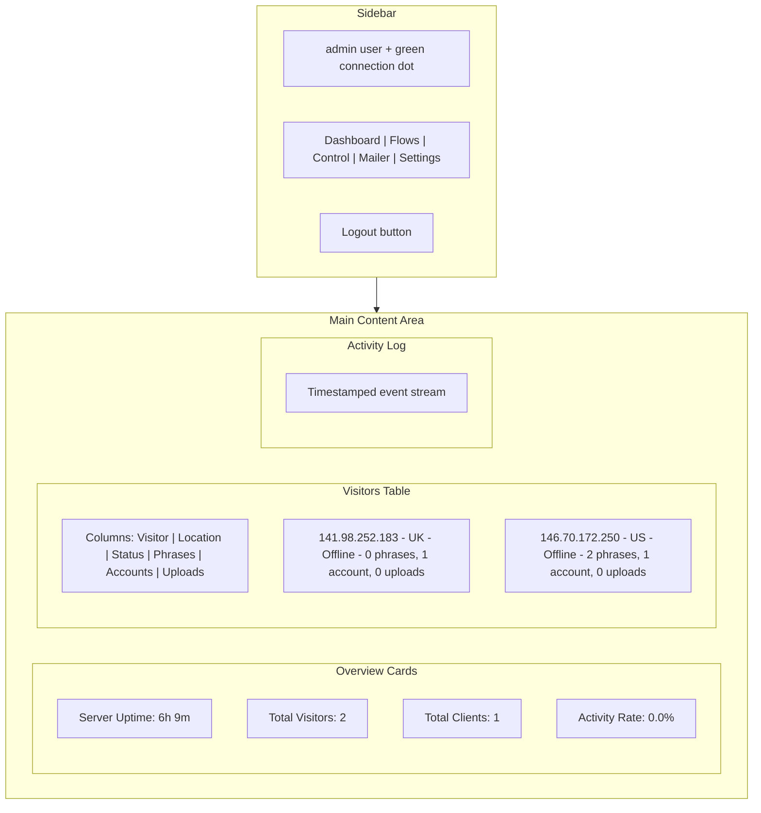

# Reverse Engineering Analysis: issues-crypto.com Client Dashboard

## What This Is

This folder contains an **incomplete static snapshot** (saved web pages) of a **phishing operations panel** -- an admin dashboard used by threat actors to monitor and manipulate victims who visit fake cryptocurrency exchange websites. **This is NOT a legitimate Crypto.com or Coinbase product.**

## Technology Stack

- **Framework:** SvelteKit (prerendered/static HTML with hydration hooks)
- **Styling:** Tailwind CSS v4 with shadcn-svelte-style design tokens (dark theme)
- **Icons:** Lucide icon library
- **Fonts:** Google Sans Code (via Google Fonts)
- **Analytics:** Cloudflare Web Analytics (beacon token: `a5fe1e84e1c0452c91562d4146a1e221`)
- **Hosting:** Served from `https://issues-crypto.com/client/` behind Cloudflare

## File Inventory

```
index.html                  -- Main dashboard (prerendered with live data snapshot)
pages/dashboard.html        -- Same dashboard (relative paths adjusted for /pages/)
pages/flows.html            -- Empty shell (only SvelteKit bootstrap, no prerendered content)
pages/control.html          -- Empty shell
pages/mailer.html           -- Empty shell
pages/settings.html         -- Empty shell
styles/0.CVw8Sy1n.css       -- Compiled Tailwind + theme tokens
styles/4.Dxm6BYFZ.css       -- Additional compiled styles
styles/file.css2            -- Google Fonts @font-face rules
scripts/file.bin            -- Cloudflare RUM beacon (minified JS)
images/crypto.svg           -- Crypto.com logo (blue hexagonal icon)
```

The `_app/immutable/` JavaScript bundles (the actual application logic) are **missing** from this export. They are referenced via absolute URLs to `https://issues-crypto.com/client/_app/immutable/...` which means the real interactive logic lives on the remote server, not in this folder.

## Dashboard UI Structure



## Five Dashboard Sections (Navigation)

- **Dashboard** -- The main overview shown in the snapshot: metrics, visitor list, activity log
- **Flows** -- Manages "flows" (scripted page sequences victims are funneled through, e.g. `crypto/loading`, `crypto/case`, `crypto/disconnect_default`)
- **Control** -- Likely a real-time victim interaction panel (icon is "users")
- **Mailer** -- Likely a bulk email/SMS sender to lure victims to the phishing pages
- **Settings** -- Per-host configuration (the log shows "admin updated settings for host...")

## How It Works (Reconstructed from Activity Log)

The activity log embedded in the HTML reveals the full operational flow. Reading the timestamps **bottom-to-top** (chronological order):

1. **3:01:54 PM** -- Visitor `146.70.172.250` (Los Angeles, US) connects, lands on `crypto/disconnect_default`
2. **3:02:04 PM** -- Same visitor moved to `crypto/loading`
3. **3:02:20 PM** -- **Admin manually pushes** the visitor to `crypto/disconnect_default`
4. **3:02:25 PM** -- Visitor reconnects on `crypto/disconnect_default`
5. **3:02:38 PM** -- Visitor moved to `crypto/loading`
6. **3:02:52 PM** -- Admin updates settings for host `891358coinbase.com` (a **typosquat domain** impersonating Coinbase)
7. **3:02:59 PM** -- Visitor `141.98.252.183` (UK) connects on `crypto/case`
8. **3:03:00 PM** -- **Account data harvested**: `[crypto] account data from 141.98.252.183 on crypto/case`
9. **3:03:01 PM** -- Same visitor moves to `crypto/loading`
10. **3:03:14 PM** -- Admin updates settings for `891358coinbase.com` again
11. **3:03:22 PM** -- Admin pushes a visitor to `crypto/disconnect_default`
12. **3:04:56 PM** -- Admin updates settings for `issues-crypto.com`
13. **3:06-3:08 PM** -- Both visitors disconnect
14. **4:42:57 PM** -- **"Redpage detected for 891358coinbase.com, domain deleted"** (the fake Coinbase domain was flagged/blocklisted, so it was auto-removed)

## Key Operational Concepts

- **"Flows"** -- Named page sequences that victims see (e.g. `crypto/loading` shows a fake loading screen, `crypto/case` is likely a fake "support case" page that harvests credentials, `crypto/disconnect_default` is a fallback/disconnect page)
- **"Phrases"** column -- Likely counts **seed phrases / recovery phrases** harvested from a victim
- **"Accounts"** column -- Counts of account credentials (email/password) stolen
- **"Uploads"** column -- Counts of files (ID documents, selfies, etc.) exfiltrated from victims
- **"Redpage"** -- The phishing page being flagged by browser safe-browsing or the hosting provider; the system auto-deletes the domain when detected
- **"Pushed visitor"** -- The admin can manually steer a victim to a different flow in real-time (e.g. from a loading screen to a credential-harvesting form)
- **Multiple hosts** -- The panel manages multiple phishing domains simultaneously (`issues-crypto.com`, `891358coinbase.com`)

## Audio Alerts

The panel has sound effects for operator notifications:
- `/assets/sounds/alert.mp3` -- New data received
- `/assets/sounds/connect.mp3` -- Victim connects
- `/assets/sounds/disconnect.mp3` -- Victim disconnects

## What is Missing

This is only a partial export. The following are **not** present locally:
- The `_app/immutable/` JavaScript bundles (all real application logic, API calls, WebSocket connections)
- The `assets/sounds/` audio files
- Any backend/server code
- The actual phishing pages that victims see

The full interactive panel would require the JS bundles from `https://issues-crypto.com/client/_app/immutable/...` to hydrate and function.

## Cloudflare Infrastructure

- **Beacon token:** `a5fe1e84e1c0452c91562d4146a1e221`
- The site uses Cloudflare for DNS/CDN, Web Analytics, and the RUM (Real User Monitoring) beacon
- Server timing headers tracked: `cfCacheStatus`, `cfEdge`, `cfExtPri`, `cfL4`, `cfOrigin`, `cfSpeedBrain`

## Summary

This is a **phishing-as-a-service (PhaaS) operator panel** that:
1. Tracks victims visiting fake crypto exchange sites in real-time (with IP, geolocation, online/offline status)
2. Funnels them through scripted "flows" (fake loading pages, fake support cases, credential forms)
3. Harvests credentials, seed phrases, and uploaded documents
4. Lets the operator manually steer victims between flows in real-time
5. Manages multiple phishing domains simultaneously
6. Auto-detects and removes domains that get flagged ("redpage")
7. Includes a bulk mailer for sending phishing lures
8. Plays audio alerts when victims connect/disconnect
